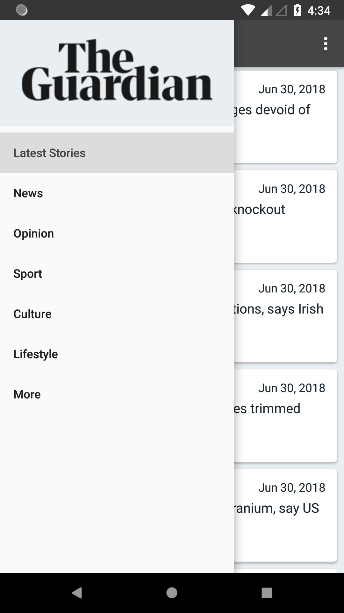
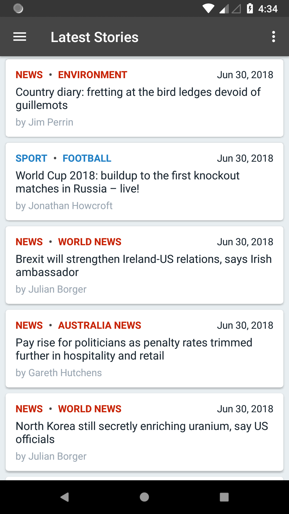
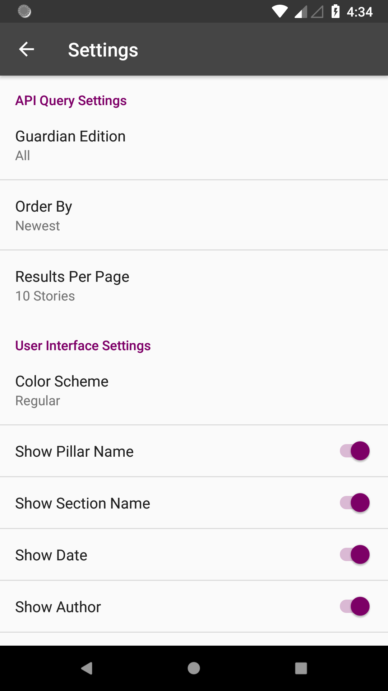

# NewsApp
An Android app that queries the Guardian API for news articles.

This is Project 6 (News App Stage 1) for the Udacity Android Basics Nanodegree.

<ul>
  <h3>Features:</h3>
  <li>Uses Loader to make API requests on a background thread</li>
  <li>Uses RecyclerView and CardViews</li>
  <li>Pagination (infinite scrolling) - requests additional pages of results as needed</li>
  <li>Navigation Drawer to browse different Pillars (sets of Sections) of The Guardian</li>
  <li>Settings (sharedPreferences) which affect API query results</li>
  <li>Swipe down to refresh</li>
  <li>RecyclerView does not forget contents or scroll position when rotating the screen</li>
</ul>

 

<table>
  <tr>
    <td>
      
    </td>
        <td>
      
    </td>
        <td>
      
    </td>
  </tr>
</table>
